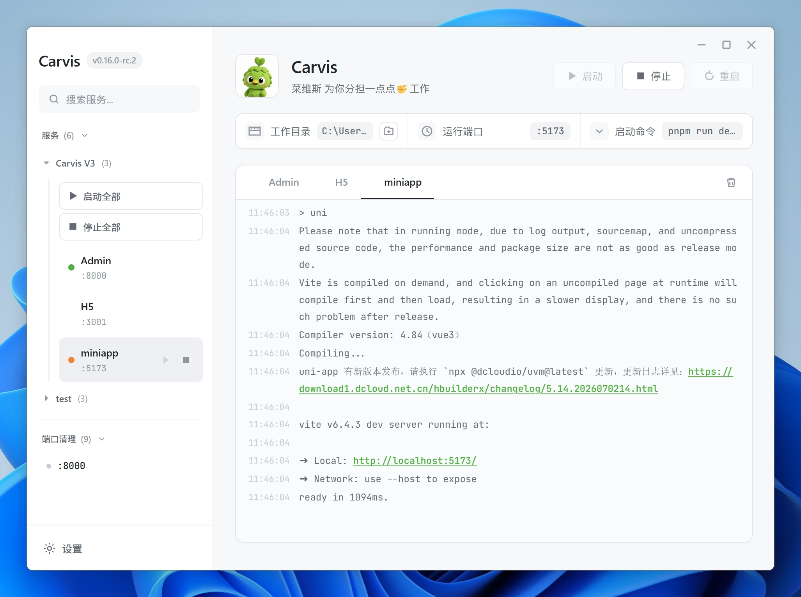

<div align="center"></div>

<div align="center"><h1>Carvis — 本地开发服务管理工具</h1></div>

<div align="center"><p><strong>菜维斯，为你分担一点点🤏工作</strong></p></div>

<div align="center"><p>Carvis 是一款面向开发者的本地服务管理桌面应用，用图形化界面替代繁琐的命令行操作，让启动、监控、管理多个开发服务变得像点击按钮一样简单。</p></div>

<div align="center"><p>
<a href="https://opensource.org/licenses/MIT"></a>
&nbsp;

&nbsp;
<a href="https://tauri.app/"></a>
&nbsp;
<a href="https://vuejs.org/"></a>
</p></div>

---

## 界面预览


---

## 下载安装

| **平台** | **macOS X64/ARM64** | **Windows X64/ARM64** |
| :---: | :---: | :---: |
| **下载** | [](https://github.com/Yooong123/carvise) | [](https://github.com/Yooong123/carvise/releases/tag/v0.10.0) |

---

## 功能特性

### 服务生命周期管理

- **启动 / 停止 / 重启** — 单个服务的完整生命周期控制
- **批量操作** — 一键启动全部 / 停止全部服务；分组批量控制

### 终端日志系统

- **实时日志流** — stdout / stderr 实时采集，终端风格滚动显示
- **HTTP 地址可点击** — 自动识别 URL，点击调用系统浏览器打开
- **内存保护** — 单服务日志最大 500 条，超限自动裁剪；ANSI 码自动清洗

### 端口清理

- **占用检测**— 跨平台扫描（Windows：netstat / macOS：lsof / Linux：ss）
- **智能保护** — 自动跳过由 Carvis 管理的服务端口，防止误杀
- **一键终止** — 自动识别 PID 并执行跨平台强制终止

### 服务分组管理

- 创建 / 命名 / 删除分组；上移 / 下移排序；展开 / 折叠
- 右键菜单快速分配服务到分组；分组内批量启停

### 配置中心

- 图形化服务 CRUD（ID、显示名称、工作目录、命令、参数、端口）
- 分组管理 + 端口清理列表配置

---

## 技术栈

| 层级   | 技术                                                        |
| ---- | --------------------------------------------------------- |
| 前端   | Vue 3 (Composition API) + Vite 6                          |
| 桌面框架 | **Tauri 2**（Rust 后端 + 系统 WebView）                         |
| 系统能力 | tauri-plugin-shell / opener / autostart / single-instance |
| 构建打包 | tauri build（NSIS / DMG / AppImage / deb）                  |
| 样式   | 纯 CSS（无 UI 框架依赖）                                          |
| 字体   | Inter（界面）+ JetBrains Mono（终端）                             |
| 平台支持 | Windows 10+ / **macOS 10.15+** / Linux                    |

---

## 项目结构

```
carvis/
├── src-tauri/                   # Rust 后端（Tauri 2）
│   ├── src/
│   │   ├── main.rs              # 入口
│   │   ├── lib.rs               # 应用装配：插件/托盘/单例/窗口事件/命令注册
│   │   ├── state.rs             # 全局托管状态
│   │   ├── config.rs            # 配置模型 + 校验 + 加载/持久化/迁移
│   │   ├── process.rs           # 进程管理
│   │   ├── port.rs              # 端口探测/清理/固定
│   │   └── commands.rs          # IPC 命令
│   ├── icons/                   # 应用图标（多尺寸）
│   ├── Cargo.toml               # Rust 依赖
│   └── tauri.conf.json          # 窗口/打包/应用标识配置
├── src/                         # Vue 前端
│   ├── services/
│   │   └── tauriApi.ts          # 桥接层
│   ├── components/
│   │   ├── TerminalPanel.vue    # 终端日志面板
│   │   ├── SettingsModal.vue    # 设置弹窗
│   │   └── PortKiller.vue       # 端口清理组件
│   ├── styles/
│   │   └── marvis-light.css     # 主题样式（含 macOS 适配）
│   ├── App.vue                  # 根组件
│   └── main.js                  # Vue 入口
├── public/                      # 静态资源
├── package.json
├── vite.config.js
└── index.html
```

> `src-tauri/target/`、`node_modules/`、`dist/` 均为构建产物，已被 `.gitignore` 排除。

---

## 架构概览

```
渲染层 (WebView)    ←→  桥接层 (tauriApi.ts)  ←→  核心层 (Rust / Tauri)
 Vue 3 + Vite              IPC + 事件订阅            进程/端口/配置管理
 无边框窗口                 _invoke(5s 超时)           插件: shell/opener/
 三模主题                   {success, data?, error?}  autostart/single-instance
```

底层通过 OS 原生命令与进程交互：Windows 用 `cmd.exe / taskkill / netstat`；macOS/Linux 用 `sh / kill / lsof / ss`。

---

## 快速开始

### 环境要求

| 依赖                    | 用途             | 安装方式                                                       |
| --------------------- | -------------- | ---------------------------------------------------------- |
| **Node.js >= 18**     | 前端构建 & npm 包管理 | [nodejs.org](https://nodejs.org/)                          |
| **Rust 工具链** (stable) | 编译 Tauri 后端    | [rustup.rs](https://rustup.rs/)                            |
| **系统 WebView**        | 渲染 UI          | Win10+ 自带 WebView2；macOS 内置 WKWebView；Linux 需 `webkit2gtk` |

> Tauri CLI 通过 npm script 调用，**无需全局安装** `@tauri-apps/cli`。

### 安装依赖

```bash
npm install
```

### 开发模式

```bash
# Tauri 窗口 + Vite 热更新（推荐）
npm run tauri:dev

# 仅页面调试（无桌面外壳）
npm run dev
```

### 生产构建

```bash
# 构建当前平台的安装包（在对应平台上运行即可产出对应格式）
npm run tauri:build
```

---

## 构建与打包

### 各平台前置条件

| 平台      | 额外依赖                                                                                  | 说明                               |
| ------- | ------------------------------------------------------------------------------------- | -------------------------------- |
| Windows | [MSVC Build Tools](https://visualstudio.microsoft.com/visual-cpp-build-tools/) + NSIS | MSVC 提供 link.exe；NSIS 打包安装包      |
| macOS   | Xcode Command Line Tools                                                              | 终端运行 `xcode-select --install` 即可 |
| Linux   | webkit2gtk-dev                                                                        | 各发行包名不同，参见 Tauri 文档              |

### 构建产物位置

运行 `npm run tauri:build` 后，产物输出到 `src-tauri/target/release/bundle/`：

```
bundle/
├── nsis/
│   └── Carvis_0.10.0_x64-setup.exe      ← Windows 安装包（~2.2 MB）
├── msi/
│   └── Carvis_0.10.0_x64.msi            ← Windows MSI 安装包
├── dmg/
│   └── Carvis_0.10.0_aarch64.dmg        ← macOS DMG（Apple Silicon，需在 Mac 构建
│   └── Carvis_0.10.0_x64.dmg            ← macOS DMG（Intel，需在 Mac 构建）
├── macos/
│   └── Carvis.app                       ← macOS 应用包
├── appimage/
│   └── Carvis_0.10.0_amd64.AppImage      ← Linux AppImage
└── deb/
    └── carvis_0.10.0_amd64.deb           ← Linux deb 包
```

### 构建流程

`npm run tauri:build` 执行以下步骤：

1. **`vite build`** — 编译 Vue 前端到 `dist/`
2. **`cargo build --release`** — 编译 Rust 后端，将前端内嵌为二进制
3. **Tauri 打包器** — 将二进制打包为目标平台的安装包格式

首次构建会下载并编译全部 Rust 依赖（约 200+ crate），后续增量编译通常 < 1 分钟。

### 更换应用图标

```bash
# 准备一张 ≥1024×1024 的正方形 PNG
npm run tauri:icon path/to/icon.png

# 重新构建（新图标自动嵌入所有产物）
npm run tauri:build
```

### 构建缓存清理

以下均为可再生的构建产物，安全删除：

| 目录                  | 典型大小   | 重建命令                  |
| ------------------- | ------ | --------------------- |
| `src-tauri/target/` | ~6 GB  | `npm run tauri:build` |
| `node_modules/`     | ~80 MB | `npm install`         |
| `dist/`             | ~1 MB  | `npm run build`       |

---

## macOS 用户注意

当前构建版本未签名（无 Apple Developer ID）。将 Carvis 拖入「应用程序」后，请先执行一次以下命令清除隔离标志：

```bash
xattr -cr /Applications/Carvis.app
```

或右键 `Carvis.app` →「打开」→ 在弹窗中点「打开」亦可。

支持 **macOS 10.15 (Catalina) 及以上**，Apple Silicon 与 Intel 均支持。

---

## 配置说明

服务配置存储在 Tauri 应用配置目录：

```
Windows: %APPDATA%/com.carvis.app/config.json
macOS:   ~/Library/Application Support/com.carvis.app/config.json
Linux:   ~/.config/com.carvis.app/config.json
```

旧版 Electron 的配置会在首次启动时自动迁移至新路径，无需手动拷贝。

### 配置结构

```json
{
  "services": [
    {
      "id": "frontend",
      "name": "frontend",
      "label": "前端服务",
      "cwd": "C:/projects/my-app",
      "command": "pnpm",
      "args": ["run", "dev"],
      "port": 3000
    }
  ],
  "groups": [
    {
      "id": "group-xxx",
      "name": "前端组",
      "serviceIds": ["frontend"],
      "_expanded": true
    }
  ],
  "portKiller": {
    "ports": [8080, 3000]
  },
  "settings": {
    "autoStart": false,
    "minimizeToTray": false,
    "theme": "system"
  }
}
```

---

## Contributing

欢迎参与贡献！以下是本地开发的基本流程：

1. Fork 本仓库并克隆到本地
2. `npm install` 安装依赖
3. `npm run tauri:dev` 启动开发模式
4. 创建分支进行开发：`git checkout -b feat/your-feature`
5. 提交 PR 时请确保：
   - 代码风格与项目一致
   - 新增功能有简要说明
   - 不引入不必要的依赖

如有问题或建议，欢迎提 Issue 讨论。

---

## License

[MIT](./LICENSE)
